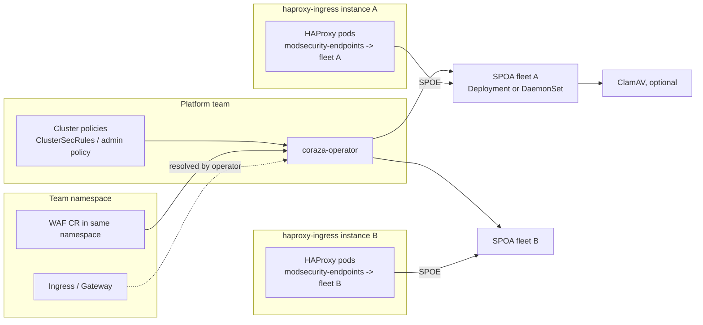

# Operational Target

Binding description of **how this operator is meant to be operated** once finished.
It is the north star for every ticket: a change either advances one of the targets
below, or it needs an explicit reason why not.

> Related: [CLAUDE.md](CLAUDE.md) (engineering rules) · [PLAN.md](PLAN.md) (design Q&A,
> German) · [README.md](README.md) (user docs).

## 0. How to use this document

1. Every ticket names the target IDs it advances (`T1`…`T10`) or the invariant it
   protects (`I1`…`I6`).
2. A ticket that contradicts a target must say so and propose the amendment — the
   target list wins by default, the ticket does not.
3. When a target is reached, its **Status** line moves to `Done` with a link to the
   implementing code, not to the PR.
4. This list grows. Additions go at the end and keep their ID forever.

Legend for status: `Done` · `Partial` · `Gap` (nothing yet) · `Blocked`.

---

## 1. Deployment context

The operator does **not** manage HAProxy. It provides the SPOA fleet that one or
more existing [haproxy-ingress](https://haproxy-ingress.github.io/) controller
instances talk to, plus the CRDs that let teams and admins shape what that fleet
enforces.



---

## 2. Targets

### T1 — First-class support for upstream haproxy-ingress

**Goal.** The supported integration is the original
[haproxy-ingress Helm chart / controller](https://haproxy-ingress.github.io/docs/configuration/keys/),
unmodified. Everything the operator emits must be consumable through documented
configuration keys of that controller.

**Design consequences.**
- We own the SPOA side only; HAProxy config is produced by the ingress controller
  from its own keys (see the verified key table in §4).
- The platform team must set the **Global** keys once per controller instance:
  `modsecurity-endpoints`, `modsecurity-use-coraza: true`, `modsecurity-args`,
  and the three `modsecurity-timeout-*` keys. The operator's job is to *document
  and validate* those, and to surface a mismatch as a status condition — it cannot
  set them from a team CR.
- Per-path enablement (`waf`, `waf-mode`) is a **Path**-scope key on the team's
  Ingress. This is the hook that makes T2 possible at all.
- **SPOA is the only data path — decided 2026-08-19.** The reverse-proxy mode
  (`spec.upstream`, `spec.listener`, the HTTP handler in
  [internal/enginepkg/server.go:160](internal/enginepkg/server.go#L160)) is removed.
  Keeping it would mean two rule-loading paths, two metric semantics, and every
  security decision — IP source, fail-open vs fail-closed, body limits — made and
  tested twice. What remains of the engine's HTTP surface is health and `/metrics`.

**Status.** `Partial` — SPOA listener exists ([internal/enginepkg/spoa.go](internal/enginepkg/spoa.go)),
but the Engine CRD still models a standalone reverse proxy (`spec.upstream`,
[api/v1/engine_types.go](api/v1/engine_types.go)), not an ingress-attached fleet.

**Open decisions.**
- Do we validate the controller's ConfigMap (read-only) to detect a missing
  `modsecurity-use-coraza`/`modsecurity-args`, or only document it?

---

### T2 — Team-scoped configuration, namespace-tight

**Goal.** A team configures the WAF for **its own** Ingress / Gateway-API resources
via a namespaced CR. It must be impossible for a team to change WAF behaviour for
an Ingress in another namespace.

**Design consequences.**
- CR references are `LocalObjectReference` only — no `namespace` field, ever.
  Validating webhook + controller both enforce it (defence in depth).
- The operator resolves the referenced Ingress, extracts host/path matchers *from
  that object*, and compiles them into the fleet's routing table.
- **Host-claim ledger (I1) — decided 2026-08-19.** The namespace is a valid
  *authoring* scope but not an *enforcement* scope: the SPOA sees only `Host` and
  `path` on the wire, never a namespace. A team may legitimately create an Ingress
  in its own namespace for a hostname another team already serves — Kubernetes has
  no concept of host ownership — and its CR would then match foreign traffic, in
  both directions (weakening the other team's protection, or blocking its traffic).
  Upstream resolves such conflicts as *oldest wins* and logs a warning only (§4), so
  nothing on the Ingress object reveals the loss.
  **The operator mirrors that rule:** the Ingress with the oldest `creationTimestamp`
  claims a `host` + path-rule tuple; a CR whose Ingress lost the claim is not
  compiled into the fleet and reports `Degraded` with the winning namespace named.
  Same semantics as the controller — one truth, and the log-only warning becomes
  visible in the API.
  Details for the implementing ticket: claim key is `(host, pathType, path)`, not the
  bare host — two namespaces may legitimately own different paths of one hostname; a
  later, broader `Prefix` claim that subsumes an existing narrower one loses on the
  overlapping subtree only; ties on equal timestamps break deterministically by
  `namespace/name`; releasing a claim on Ingress deletion must be reconciled, or a
  hostname stays permanently locked.
- Matching needs `Host` and `path` inside the SPOA. `path` is a default
  `modsecurity-args` field; `Host` only arrives inside `req.hdrs_bin`.

**Status.** `Gap` — no Ingress/Gateway reference exists in the API today.

---

### T3 — Origin-level controls (IP ranges, path/method scoping)

**Goal.** Configurable per team CR:
- client must originate from a given IP range,
- clients from range X may only call certain paths / use certain HTTP methods.

The real client IP is transmitted to the WAF and stays available to rules. Client
TLS against a given CA is **out of operator scope** — the team sets the Ingress
annotations itself, we only document it. See [D1](#d1--client-tls-mtls--documented-only).

**Two-layer model.** HAProxy filters coarse, the WAF decides fine:

| Layer | What it does | Owner |
|---|---|---|
| HAProxy `allowlist-source-range` / `denylist-source-range` (Path scope) | Recommended coarse pre-filter — blocks traffic before it costs an SPOE round trip. Optional, see [D2](#d2--allowlist-source-range-as-a-pre-filter-recommended) | Team annotation |
| SPOA SecRules on `REMOTE_ADDR` | Authoritative, fine-grained enforcement: IP × path × method, per-rule metrics | Team CR ⇒ operator |

The pre-filter never replaces the SecRule. A CR must stay correct on its own, because
we cannot verify that the annotation is present (I2: read-only), and a fleet may serve
Ingresses without it.

**Feasibility — split by enforcement point (verified, see §4):**

| Sub-requirement | Enforcement point | Note |
|---|---|---|
| Client from IP range | Generated SecRule on `REMOTE_ADDR` | Also the source of the per-endpoint block metrics (T6) |
| IP range ⇒ only these paths / methods | Generated SecRules `REMOTE_ADDR` × `REQUEST_URI` × `REQUEST_METHOD` | No native key covers this combination |
| Certificate attributes usable in rules | SecRule on request headers | Requires the team to enable `auth-tls-cert-header`; prefix from `ssl-headers-prefix` (Global, default `X-SSL`) |

**Design consequences.**
- Everything T3 enforces lives inside the SPOA. The operator writes **no** Ingress
  annotations, so it needs no write permission on team-owned Ingress objects (I2).
- **The client IP must reach the SPOA.** `modsecurity-args` (Global) has to be
  extended with `src`; `src_port` is worth taking along for log correlation. This is
  a platform-team action per controller instance and a hard precondition for T3 —
  the operator surfaces its absence as a `Degraded` condition instead of pretending
  the rules work.
- **Extend by appending, never by inserting.** Verified in
  [internal/enginepkg/spoa.go:105-137](internal/enginepkg/spoa.go#L105-L137): the
  controller sends SPOE args positionally, so the handler falls back to declaration
  order when the wire-level name is empty. Inserting `src` in the middle of
  `modsecurity-args` silently re-maps `path`, `req.hdrs_bin` and `req.body` to the
  wrong fields. We therefore publish exactly one canonical arg string, appended-only,
  and the SPOA validates the arg count it receives.
- **Verified blocker:** [internal/enginepkg/spoa.go:163](internal/enginepkg/spoa.go#L163)
  calls `tx.ProcessConnection("", 0, "", 0)` — `REMOTE_ADDR` is empty, so every
  IP-based rule is inert today, silently. Fix = parse `src` and pass it into
  `ProcessConnection`. Trusting `X-Forwarded-For` instead is only acceptable when the
  hop in front of HAProxy is trusted; that must be an explicit opt-in field, never
  the default, and it must be per fleet, not per team CR — a team must not be able to
  declare its own upstream trustworthy.

**Status.** `Gap`.

---

### T4 — Cluster-wide admin rules that teams cannot weaken

**Goal.** An admin defines rules enforced across all endpoints, or across endpoints
matching given URL/host selectors, independent of team CRs. Teams keep full freedom
to write their own deny rules — the restriction is on self-disarming constructs, not
on rule outcomes.

**Enforcement model — decided 2026-08-19.** Admin rules attach to the `Engine`
(T9), not to the team's `RuleSet`, so a team cannot decline them by omitting a
source. Compile order per phase: `admin-pre → team → admin-post`.

Three layers, because each is bypassable on its own:

1. **Directive allowlist.** Teams may use `SecRule`, `SecAction`, `SecMarker`. Every
   engine-scope directive is rejected: `SecRuleEngine`, `SecDefaultAction`,
   `SecRequestBodyAccess`, `SecRuleRemoveById|ByTag|ByMsg`, `SecRemoteRules`
   (network fetch + supply chain from a team CR), `Include`, `SecDataDir`,
   `SecTmpDir`, `SecAuditLog*`, `SecDebugLog*`.
2. **Action allowlist inside permitted rules.** `ctl:` is the runtime form of the
   forbidden directives — `ctl:ruleEngine=Off` inside a formally legal `SecRule`
   disarms the fleet. Rejected: `ctl:*`, `allow` (skips the remaining evaluation,
   including `admin-post`), `exec`, `proxy` (SSRF from the WAF pod), `setvar` on
   foreign `tx.*` collections (anomaly-score tampering), `skipAfter` to a foreign
   marker. Permitted: `id`, `phase`, `deny`, `block`, `drop`, `pass`, `log`/`nolog`,
   `msg`, `tag`, `severity`, `status`, `t:*`, `capture`, `chain`, `setvar` on own
   variables, `skipAfter` to own markers.
3. **Rule-ID partitioning.** Fixed blocks per origin (admin / CRS / per-namespace
   team block). Rules without an `id` or outside the own block are rejected. The
   existing cross-source duplicate check in
   [internal/compiler/compiler.go:96-103](internal/compiler/compiler.go#L96-L103)
   stays as the second line of defence.

**Tenant scoping is generated, never authored.** One fleet loads one rule set for all
Ingresses of its instance, so an unguarded team rule would hit foreign traffic. The
operator wraps each tenant's rules in a host/path guard:

```
SecRule REQUEST_HEADERS:Host "!@streq shop.example.com" \
    "id:<guard-id>,phase:1,pass,nolog,skipAfter:END_TENANT_ns-a"
    ... team rules ...
SecMarker END_TENANT_ns-a
```

`skipAfter` only works within a phase, so a guard is generated **per phase** a tenant
has rules in.

**CRS exclusions stay typed.** False-positive tuning needs exactly the forbidden
`SecRuleRemoveById` / `SecRuleUpdateTargetById`, so it becomes a schema field the
operator translates — restricted to IDs outside the admin block, and auditable
instead of buried in a text blob:

```yaml
exclusions:
  - ruleId: 942100        # example
    path: /admin/import   # example
    reason: "false positive on base64 payload"
```

**Enforcement point.** Validating webhook, so a violation surfaces on `kubectl apply`
rather than as a silent reconcile failure. Rules are additionally re-checked at
compile time — a webhook can be bypassed by a disabled webhook configuration.

**Known limits to document with this (not defects):**
- Cross-phase ordering is Coraza semantics: an admin rule in phase 2 always runs
  after a team rule in phase 1.
- CRS blocks by anomaly score, a team rule with `deny` blocks immediately. Both
  models coexist; only CRS may write `tx.anomaly_score`.
- Stateful rules (rate limit, brute force) count per pod, not per fleet — with 3
  replicas a counter sees roughly a third of the traffic. No shared store, no
  fleet-wide counting.

**Status.** `Partial` — `ClusterSecRules` exists
([api/v1/clustersecrules_types.go](api/v1/clustersecrules_types.go)) but is opt-in via
`RuleSet.spec.sources`, and [internal/compiler/compiler.go](internal/compiler/compiler.go)
passes every non-`SecRule` line through verbatim: a team body starting with
`SecRuleEngine Off` currently lands in the compiled bundle unfiltered.

---

### T5 — Standard rule sets out of the box

**Goal.** Ship curated, versioned baseline rules (OWASP CRS first) so a team gets
meaningful protection without writing SecRules.

**Design consequences.**
- Versioned and pinnable; upgrading CRS must be an explicit, reversible action.
- Paranoia level + anomaly thresholds exposed as typed CR fields, not free text.
- A supported exclusion mechanism (per rule ID / per path) so teams can fix false
  positives without dropping the whole set — and so exclusions stay auditable.
- Detection-only rollout path per T-set: run new baseline in detect mode, compare
  metrics (T6), then switch to blocking.

**Status.** `Gap`.

---

### T6 — Metrics that show the current threat situation per endpoint

**Goal.** Rich metrics answering: which endpoint is under attack, with what, how
often, blocked or only detected, trending how.

**Design consequences.**
- **Scope for 0.1.0 — decided 2026-08-19: Prometheus only.** The TimescaleDB event
  pipeline (PLAN.md §2.7) is deferred to a later release. Consequence for T7:
  dashboards and alerts must be answerable from aggregates alone; anything needing
  per-request detail (top attacking IPs, single-event drill-down, forensics) is out
  of scope until the event path exists, and must not be promised in the chart.
- Dimensions worth having: ingress instance, namespace, host, path group, rule ID
  or rule tag, anomaly score bucket, action (detect/block), engine phase.
- **Cardinality budget is a design constraint, not an afterthought**: `rule_id ×
  host × path` explodes. Plan: high-cardinality detail into event/log records
  (and, per PLAN.md §2.7, the TimescaleDB backend), low-cardinality aggregates into
  Prometheus. Path must be normalised to the Ingress *path rule*, never the raw URI.
- Client IP is personal data in many jurisdictions — it belongs in events with a
  retention policy, not in a Prometheus label.

**Status.** `Partial` — SPOA-level Prometheus metrics exist
([internal/enginepkg/spoa.go](internal/enginepkg/spoa.go),
[internal/enginepkg/metrics.go](internal/enginepkg/metrics.go)); no per-endpoint
or per-rule dimensioning, no event pipeline.

---

### T7 — Alerts and dashboards shipped with the chart

**Goal.** The Helm chart delivers usable `PrometheusRule` alerts and Grafana
dashboards, not just raw metrics.

**Design consequences.**
- Toggleable (`monitoring.prometheusRule.enabled`, `monitoring.dashboards.enabled`)
  and label-configurable for the cluster's Prometheus/Grafana discovery.
- Two alert classes: **operational** (fleet down, SPOE timeouts, rule reload
  failure, config drift) and **security** (block-rate spike, anomaly-score spike,
  new rule ID firing at volume).
- Dashboards must be derivable from T6 metrics only — no dashboard invents a metric
  the operator does not export.

**Status.** `Gap` — chart has metrics service only
([charts/coraza-operator/templates/](charts/coraza-operator/templates/)).

---

### T8 — Fleet workload shape is fully configurable

**Goal.** Replicas, affinity/anti-affinity, tolerations, node selectors, and
Deployment-vs-DaemonSet are configurable per fleet.

**Design consequences.**
- One workload abstraction rendering both shapes; `replicas` is invalid for
  DaemonSet and must be rejected, not ignored.
- DaemonSet is the low-latency shape (node-local SPOA) but only pays off with
  topology-aware routing from HAProxy — otherwise it is just more pods.
- Also needed for a real fleet: PDB, resources, topology spread, priorityClass,
  graceful drain (SPOE connections are long-lived and idle-timeout bound).

**Status.** `Gap` — only `replicas` and `resources` exist today
([api/v1/engine_types.go](api/v1/engine_types.go)).

---

### T9 — One SPOA fleet per haproxy-ingress instance

**Goal.** Multiple haproxy-ingress instances are supported, each with its own rule
scope and its own dedicated SPOA fleet.

**Verified constraint.** `modsecurity-endpoints` is a **Global**-scope key: one
controller instance points at exactly one SPOA endpoint list, which must serve all
WAF-enabled endpoints of that instance. Therefore per-Ingress differentiation
happens *inside* the fleet, based on SPOE-transmitted request metadata — never by
pointing HAProxy at different backends.

**API shape — decided 2026-08-19.** The fleet stays the existing `Engine` kind,
**namespaced**, and is deployed into the same namespace as the HAProxy instance it
serves. That namespace is platform-team-owned, so ordinary namespace RBAC keeps
teams out — no cluster-scoped object needed.

```yaml
apiVersion: waf.gtrfc.com/v1
kind: Engine
metadata:
  name: waf
  namespace: haproxy-prod          # example — next to the HAProxy it serves
spec:
  ingressClassName: haproxy-prod   # example — the binding (T9)
  workload:                        # T8
    kind: Deployment               # default; DaemonSet as alternative
    replicas: 3                    # example; rejected for DaemonSet
  baselineRuleSetRef:              # admin baseline, e.g. CRS (T5)
    name: crs-baseline
```

**Design consequences.**
- Resolution chain, so a team never names a fleet:
  `team CR (ns-a) → Ingress (ns-a) → spec.ingressClassName → Engine with the matching
  ingressClassName`. A `fleetRef` in the team CR would let a team attach policy to a
  foreign instance and must not exist.
- **The object is namespaced, its effect is cluster-wide** — it aggregates policies
  from every namespace whose Ingresses use the bound class. The operator therefore
  reads Ingresses cluster-wide, read-only (I2).
- Two `Engine` objects with the same `ingressClassName` are rejected by the
  validating webhook. Unlike the host claim (I1), oldest-wins is wrong here: there is
  no upstream semantic to mirror, both objects belong to the platform team, and
  silently picking one would leave the operator's effective rule base ambiguous.
- Several HAProxy instances may share a namespace; the ingress class separates them,
  not the namespace.
- The fleet holds the union of all policies of its instance, keyed by host+path, plus
  the admin rules of T4.
- Fleet rule reloads must stay atomic (see [CLAUDE.md](CLAUDE.md) — partial updates
  corrupt the loaded rule set) and must not drop in-flight SPOE connections.
- Fields in [api/v1/engine_types.go](api/v1/engine_types.go): `spec.upstream` and
  `spec.listener` are removed with the reverse-proxy mode (T1); `spec.listener.spoaPort`
  survives as the SPOA listener setting; `ruleSetRef` becomes the admin baseline
  rather than the only rule source.

**Status.** `Gap` — no ingress-class binding, no workload shape, no policy aggregation.

---

### T10 — Optional ClamAV malware scanning (request path)

**Goal.** Optionally scan bodies for malware via ClamAV.

**Verified 2026-08-19 — egress/response scanning is not available upstream.** The
controller's SPOE template
([rootfs/etc/templates/modsecurity/modsecurity.tmpl](https://github.com/jcmoraisjr/haproxy-ingress/blob/master/rootfs/etc/templates/modsecurity/modsecurity.tmpl))
declares exactly **one** message and binds it to a single event:

```
spoe-agent modsecurity-agent
    messages     coraza-req          # when modsecurity-use-coraza is true
    option       var-prefix  coraza
spoe-message coraza-req
    args   {{ $modsec.Args | join " " }}
    event  on-backend-http-request
```

There is no `on-http-response` message, and no configuration key adds one. Response
bodies therefore never reach the SPOA. Consequences:
- **T10 is request-path only.** Outbound/response scanning cannot be promised with
  the unmodified upstream chart (T1). Delivering it would require an upstream change
  or a forked template — that is a separate decision, not an implementation detail.
- The same limit applies to every response-side idea (T5 response rules, T6 response
  metrics): CRS phase 3/4 rules will load but can never fire.

**Design consequences for the request path.**
- Body availability is bounded by HAProxy buffers, so large uploads cannot be fully
  scanned. The CR needs an explicit `maxScanSize` and a documented
  `onOversize: allow|deny`; claiming "all uploads scanned" would be false.
- Latency budget: scanning is synchronous inside `modsecurity-timeout-processing`
  (default `1s`). Either raise it per fleet or make the timeout behaviour explicit.
- **Fail-open vs fail-closed (I6) is currently hardcoded the wrong way:**
  [internal/enginepkg/spoa.go:284-291](internal/enginepkg/spoa.go#L284-L291) sets
  `action=allow` on any processing error, with a `TODO` to make it configurable. In
  Blocking mode a ClamAV outage or a rule error would silently pass traffic. This must
  become a per-fleet setting defaulting to fail-closed in Blocking mode before T10.
- Deployment shape: clamd as sidecar (isolated per fleet, ~1 GB signature DB per pod)
  vs shared clamd Service (cheaper, shared blast radius).

**Status.** `Gap` — request path unimplemented; response path ruled out upstream.

---

## 2b. Documented, out of operator scope

Things a team needs but the operator deliberately does not manage. They belong in
[README.md](README.md) as copy-pasteable snippets and, where the operator can see
them, in CR status conditions — never as writes performed by the operator.

### D1 — Client TLS (mTLS), documented only

The team sets these annotations on its own Ingress (verified scopes in §4):

```yaml
metadata:
  annotations:
    haproxy-ingress.github.io/auth-tls-secret: <namespace>/<ca-secret>   # example
    haproxy-ingress.github.io/auth-tls-verify-client: "on"               # default
    haproxy-ingress.github.io/auth-tls-strict: "true"                    # default
    haproxy-ingress.github.io/auth-tls-cert-header: "true"               # example, needed for cert-based SecRules
```

Consequences of this decision:
- The operator needs **no write access** to Ingress objects (I2) — the biggest single
  privilege reduction available to this design.
- The team owns the CA secret and its rotation. The operator has no visibility into
  expiry, so no alert can be promised for it (T7).
- `auth-tls-verify-client: optional` / `optional_no_ca` silently downgrade the check
  to "no verification". If the operator reads the annotation, that value is worth a
  warning condition — read-only, still no write.
- Cert-based SecRules (T3) only work when the team also enables `auth-tls-cert-header`;
  the CR must fail loudly if such a rule is configured while the header is absent,
  rather than passing traffic unchecked.

---

### D2 — `allowlist-source-range` as a pre-filter, recommended

Where a team already knows its client networks, blocking at HAProxy is cheaper than
blocking in the WAF: no SPOE round trip, no rule evaluation, no fleet capacity spent
on traffic that is rejected anyway.

```yaml
metadata:
  annotations:
    haproxy-ingress.github.io/allowlist-source-range: "10.0.0.0/8,192.0.2.0/24"  # example
```

Rules for using it:
- **Recommended, never required.** The equivalent SecRule in the CR stays the
  authoritative control; the annotation is an optimisation on top (T3).
- **Metrics blind spot (T6):** traffic dropped by HAProxy never reaches the SPOA, so
  it produces no WAF metrics and no attack events. Dashboards must either pull HAProxy
  frontend/backend deny counters as well, or the panel legend states plainly that the
  WAF view excludes pre-filtered traffic. Silently under-reporting an attack volume is
  worse than not showing it.
- `allowlist-source-header` shifts the source-IP decision to a header — only safe
  behind a trusted proxy, same reasoning as `X-Forwarded-For` in T3.
- Keeping annotation and CR range in sync is the team's job. The operator can compare
  both (it reads the Ingress) and warn on divergence, but it does not reconcile them.

---

## 3. Cross-cutting invariants

| ID | Invariant | Why |
|---|---|---|
| I1 | A team can only affect traffic it demonstrably owns: CR namespace **and** an oldest-wins host-claim over `(host, pathType, path)` | The SPOA matches on host+path only — the namespace never reaches the wire (T2) |
| I2 | The operator never writes to team-owned Ingress / Gateway objects. It reads them; anything the team must set stays an annotation the team applies itself | Cluster-wide Ingress write has no field-level RBAC — it would imply routing-hijack capability (D1, T3) |
| I3 | Admin policy is enforced, never merely offered. Team rule bodies pass a directive/action allowlist and an ID-block check; tenant host/path guards are generated, never authored | T4 |
| I4 | Rule set activation into a fleet is atomic and connection-preserving | Partial rule loads = corrupt WAF state |
| I5 | Prometheus label cardinality is bounded by design; high-cardinality data goes to events | T6/T7 stay operable at 10+ engines |
| I6 | Security-relevant defaults fail closed in blocking mode, fail open only on explicit opt-in | T10, SPOA timeouts, ClamAV outage |

---

## 4. Verified upstream facts (haproxy-ingress)

Fetched from <https://haproxy-ingress.github.io/docs/configuration/keys/> on
2026-08-19. Scope matters: **Global** = per controller instance (platform team),
**Path**/**Host** = per Ingress annotation (team).

| Key | Scope | Default | Relevance |
|---|---|---|---|
| `waf` | Path | — | `modsecurity` enables the WAF for that path → per-Ingress opt-in (T2) |
| `waf-mode` | Path | `deny` | `deny` \| `detect` → detection rollout (T5) |
| `modsecurity-endpoints` | Global | — | `IP:port` list of the SPOA fleet → one fleet per instance (T9) |
| `modsecurity-args` | Global | `unique-id method path query req.ver req.hdrs_bin req.body_size req.body` | **No `src`, no explicit host** by default → T3 requires `src` **appended** (order is positional on the wire, see T3) |
| `modsecurity-use-coraza` | Global | `false` | Must be `true` for our engine |
| `modsecurity-timeout-hello` / `-idle` / `-processing` | Global | `100ms` / `30s` / `1s` | Latency budget for rules + ClamAV (T10) |
| `auth-tls-secret`, `auth-tls-verify-client`, `auth-tls-strict`, `auth-tls-error-page` | Host | `on` / `true` | Client mTLS lives here, not in the SPOA (T3) |
| `auth-tls-cert-header`, `ssl-headers-prefix` | Backend / Global | `false` / `X-SSL` | Makes cert data visible to SecRules (T3) |
| `allowlist-source-range`, `denylist-source-range`, `allowlist-source-header` | Path | — | Native IP filtering, pre-WAF (T3, D2) |

Conflict semantics, quoted from the same page: *"A warning will be logged in the case
of a conflict, and the used value will be of the Ingress resource that was created
first."* Host-scope conflicts are resolved oldest-wins; **Path-scope keys never
conflict**; the outcome appears in controller logs only, not on the Ingress object.
This is the upstream behaviour the host-claim ledger in T2/I1 mirrors.

**SPOE contract, verified from the controller template
([modsecurity.tmpl](https://github.com/jcmoraisjr/haproxy-ingress/blob/master/rootfs/etc/templates/modsecurity/modsecurity.tmpl)):**
one agent, one message `coraza-req` (`check-request` without `modsecurity-use-coraza`),
`args` taken verbatim from `modsecurity-args`, bound to `event on-backend-http-request`.
Variable prefix is `coraza` (else `modsec`) — the SPOA answers on
`action`, `status`, `id`, `rules_hit`, `rule_ids`
([spoa.go:264-281](internal/enginepkg/spoa.go#L264-L281)). **No response-side message
exists**, which rules out egress scanning and phase 3/4 rules (T10).

Still unverified: whether Gateway API routes are covered by the same keys (T2).

---

## 5. Status matrix

| ID | Target | Status |
|---|---|---|
| T1 | haproxy-ingress as the supported integration | Partial |
| T2 | Team CR, namespace-tight, Ingress/Gateway-scoped | Gap |
| T3 | IP range / path + method controls (SPOA-enforced) | Gap |
| T4 | Enforced admin rules + team allowlist | Partial |
| T5 | Standard rule sets (CRS) | Gap |
| T6 | Threat metrics per endpoint | Partial |
| T7 | Alerts + dashboards in the chart | Gap |
| T8 | Configurable fleet workload shape | Gap |
| T9 | One `Engine` fleet per ingress instance, bound by ingress class | Gap |
| T10 | Optional ClamAV scanning, request path only | Gap |

---

## 6. Ticket checklist

Every ticket states:

1. Which `T`/`I` it advances, and how the result is verified.
2. Whether it changes the multi-tenancy boundary (T2/I1) or the operator's
   permissions (I2) — if yes, [SECURITY_ARCHITECTURE.md](SECURITY_ARCHITECTURE.md)
   is updated in the same change. A ticket that would make the operator write to a
   team-owned Ingress needs an explicit amendment of I2 first.
3. Whether it relies on a team-set annotation (§2b) — if yes, the operator validates
   and reports it, and the snippet lands in [README.md](README.md).
4. Whether it adds Prometheus labels — if yes, the cardinality estimate (I5).
5. Which upstream haproxy-ingress key it relies on, and its scope (§4) — a
   Global-scope dependency means a platform-team action, which must be documented.

## 7. Amendments

| Date | Change |
|---|---|
| 2026-08-19 | Initial version, targets T1–T10 from operator intent |
| 2026-08-19 | Client mTLS moved out of T3 into D1 (documented only); I2 tightened to "operator never writes team Ingress objects" |
| 2026-08-19 | T3: client IP (`src`) is transmitted to the WAF and stays rule-visible; `allowlist-source-range` added as recommended pre-filter (D2), not as a replacement |
| 2026-08-19 | I1 decided: operator mirrors upstream oldest-wins as a host-claim ledger; losing CRs are not compiled and report `Degraded` |
| 2026-08-19 | T9 decided: fleet stays the namespaced `Engine` kind, deployed next to its HAProxy, bound via `spec.ingressClassName`; duplicate bindings rejected |
| 2026-08-19 | Reverse-proxy mode dropped: SPOA is the only data path; `spec.upstream` / `spec.listener` removed, HTTP surface reduced to health and metrics |
| 2026-08-19 | T4 decided: admin rules injected at the Engine, three-layer allowlist for team bodies, generated per-phase tenant guards, typed CRS exclusions |
| 2026-08-19 | T6/T7 scoped: 0.1.0 is Prometheus-only, TimescaleDB event pipeline deferred; dashboards limited to aggregate-answerable questions |
| 2026-08-19 | T10 reduced to the request path: upstream SPOE template declares only `on-backend-http-request`, so response/egress scanning is not deliverable with the unmodified chart |
